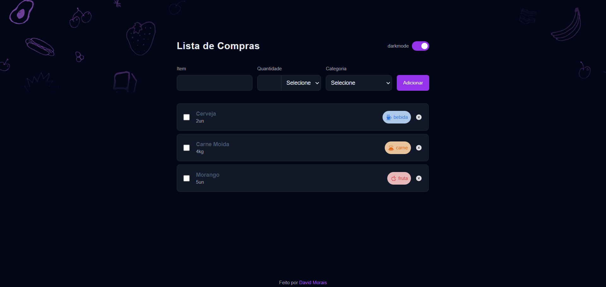

<h1 align="center">Lista de Compra - #boraCodar </h1>

Esse projeto foi desenvolvido por David Morais para o #boraCodar - Projeto de ensino da Rocketseat 

O projeto foi feito antes da resolução da equipe da Rocketseat, sendo assim foi utilizado meu conhecimento atual em Front-end para finalização do projeto, olhando apenas o screenshot disponibilizado pela equipe.

Um dos diferenciais do projeto é a capacidade de guardar os dados no localstorage, podendo ser utilizado no dia a dia, se tornando um aplicativo funcional

  <a href="#-tecnologias">Tecnologias</a>&nbsp;&nbsp;&nbsp;|&nbsp;&nbsp;&nbsp;
  <a href="#-projeto">Projeto</a>&nbsp;&nbsp;&nbsp;|&nbsp;&nbsp;&nbsp;
  <a href="#memo-licença">Licença</a>

  

 

## 🚀 Tecnologias

Esse projeto foi desenvolvido com as seguintes tecnologias:

- React
- JavaScript
- Git e Github
- Figma
- Tailwindcss
- HeadlessUI

## 💻 Projeto

 Uma aplicação para lista de compras

- [Acesse o projeto finalizado, online](https://lista-de-compra-rocketseat.vercel.app/)

## Licença

Esse projeto está sob a licença MIT.

---